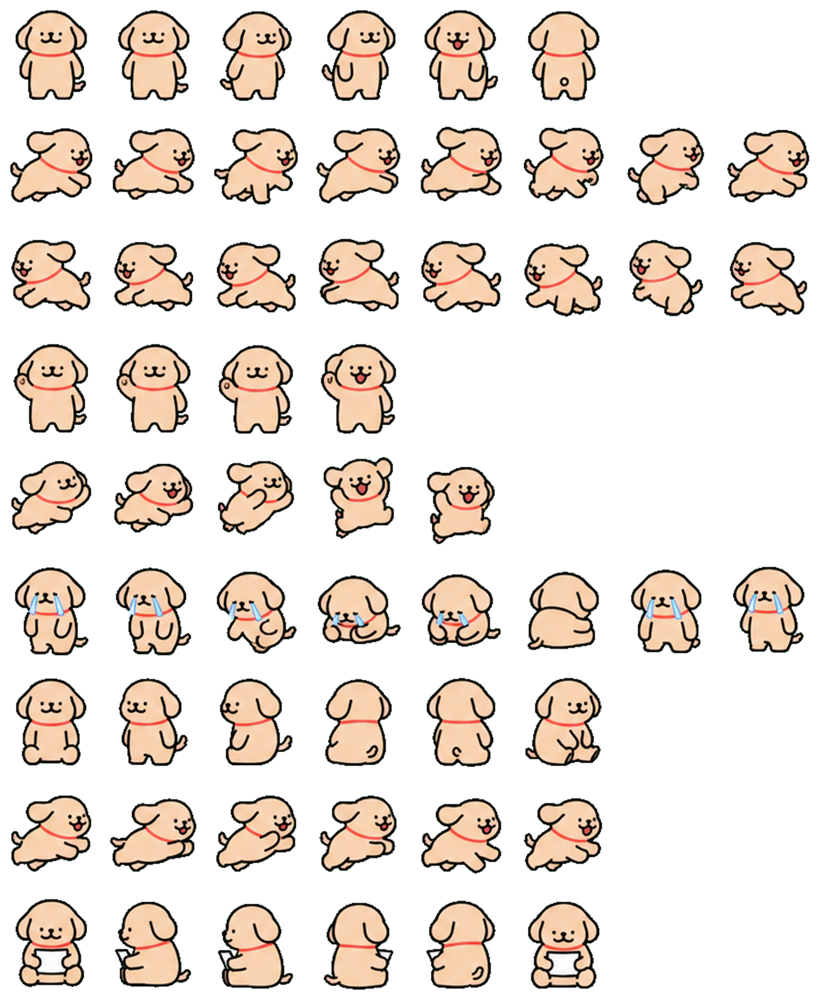

# Codex pets 宠物（线条小狗 Maltese & Golden Retriever）

将文件夹放入~/.codex/pets目录下，然后在Codex → 设置 → 宠物 中选择  
Extract it into ~/.codex/pets, Select the pet in Codex → Settings → Pets  

已上传 [codex-pet.org xiaobai 小白](https://codex-pet.org/pets/xiaobai-webp/)   [codex-pet.org xiaohuang 小黄](https://codex-pet.org/pets/xiaohuang-webp/)

*图片由AI生成，小白和小黄都有部分瑕疵*  
*Images were generated by AI, both the white and yellow images have some imperfections*  

## 小白(Maltese)
**我们天下第一好~**
White Dog  

## 小黄(Golden Retriever)
**小鸡毛~**
Yellow Dog  

